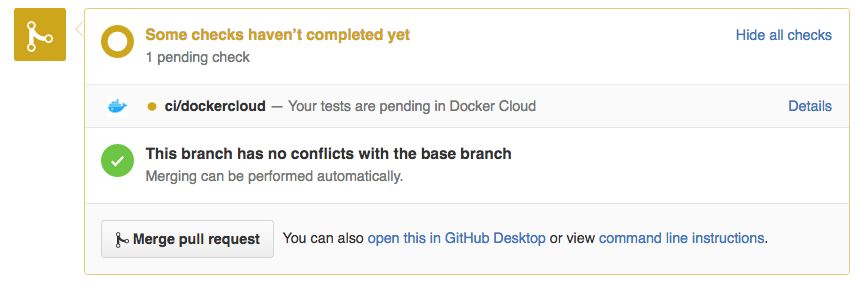
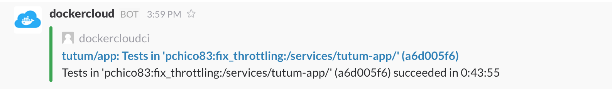
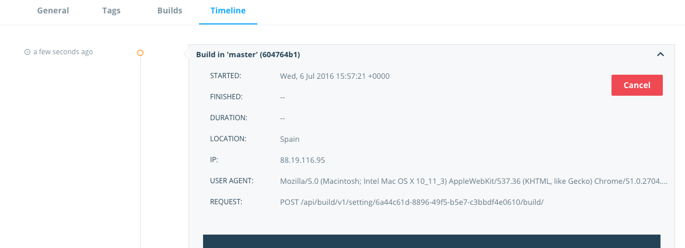

# Continuous Integration with Docker Cloud

Docker Cloud ([dockercon16 demo](https://youtu.be/ZsIb5tkyncA)) focuses on automation and collaboration, features that will empower your continuous integration workflows. Docker Cloud can automate not only the generation of docker images as Docker Hub does, but also the execution of tests for every commit in your git repository. Docker Cloud is constantly adding new features and will deprecate the Docker Hub solution soon. For example, these are some new features available in Docker Cloud:

- Integration with third party registries to follow the "batteries included but removable" mantra.
- Better integration with Github and Bitbucket to notify statuses:



- Autobuild logs are available in real time.
- Ability to define environment variables to parametrize your builds.
- Support for building in your own nodes or for selecting the right builder size to optimize your builds:


- Slack integration to notify the status of your autobuilds:



- Ability to cancel a running build or to retry a build that failed due to a temporal issue:




Each autobuilds in Docker Cloud is a sequence of three operations: build, test and push. There is a default behavior for each these operations:

- __build__: build the dockerfile specified in your build rule.

- __test__: test your image using a `docker-compose.test.yml` file (more details are available [here](https://docs.docker.com/docker-cloud/builds/automated-testing/#/set-up-automated-test-files) and [here](https://www.digitalocean.com/community/tutorials/how-to-configure-a-continuous-integration-testing-environment-with-docker-and-docker-compose-on-ubuntu-14-04)).

- __push__: push the image tag specified in your build tule to the registry.

The default behavior for these operations can be replaced using [hooks](https://docs.docker.com/docker-cloud/builds/automated-build/#/use-custom-build-phase-hooks), which makes Docker Cloud a more flexible solution for automating your continuous integration workflows. I would like to enumerate some common uses cases that can be accomplished using hooks:

- __Two-Phase Builds__: in some cases you need a set of dependencies to build your image that are different than the ones required by your application. An example is a _go_ application where the final docker image only needs a _go_ binary. This can be accoomplished using a _pre_build_ hook that compiles the go binary to make it available from your Dockerfile as one in [this repository](https://github.com/docker/dockercloud-events).

- __Build Arguments__: using Docker Cloud ability to define build of environment variables, you could define a _build_ hook that uses docker build arguments:

```
docker build --build-arg VAR=$VAR -t $IMAGE_NAME
```

Where `$VAR` is a variable defined in your Docker Cloud build configuration, and `$IMAGE_NAME` is a variable that we provide with the name of the image being built.

- __Multi-Tag Push__: there are some cases where the same image should be pushed as different docker image tags. For example, a common scenario is to generate the tag `latest` in addition to another tag that could be a git tag or a commit sha. This could be done by defining the following `post_push` hook:

```
docker tag $IMAGE_NAME $DOCKER_REPO:$SOURCE_COMMIT
docker push $DOCKER_REPO:$SOURCE_COMMIT
```

- __Webhooks__: you can write a `post_push` hook to notify external services when an autobuild succeeds. For example, you could call a Docker Cloud [redeploy trigger](https://docs.docker.com/docker-cloud/apps/triggers/) to automate continuous deployment of services running images stored in external registries.

- __Git Submodules__: Docker Cloud injects an environment variable `SSH_PRIVATE` whose value is used to clone your git repository. This ssh key only has read access to the git repository used in the build configuration. In order to clone private git submodules you could define this variable in your Docker Cloud build configuration with the value of a ssh key with access to all your git dependencies. You could also clone other repositories using the `post_checkout` hook.

The Docker Cloud Build service is currently in beta. We would love to get your feedback using the [docker community forums](https://forums.docker.com) for new feature requests or to improve the user experience of our soluction.
